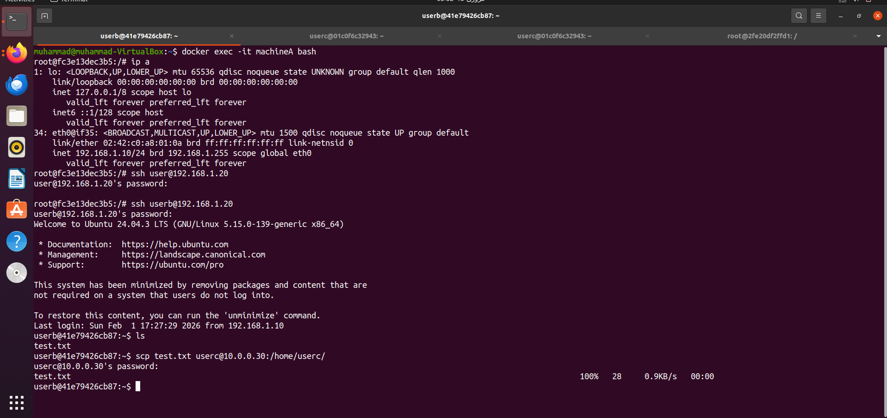
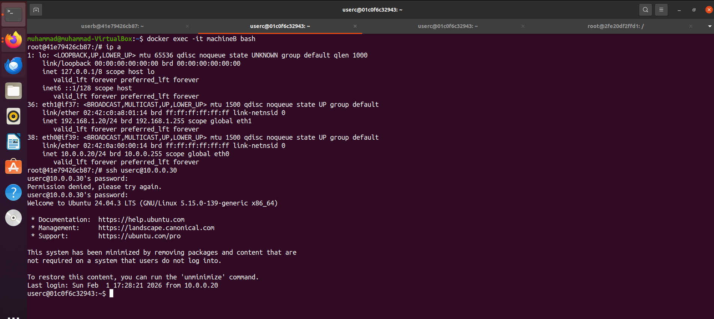
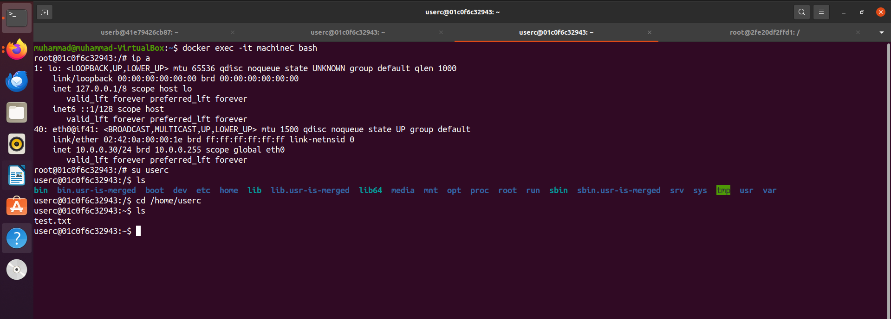
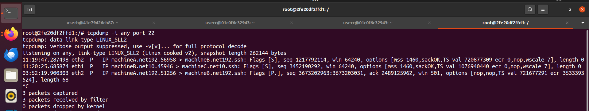

# 🔐 Firewall Evasion Simulation Using Docker Containers

](https://www.docker.com/))


## 📌 Abstract

This project demonstrates a **firewall evasion scenario using Docker-based virtual machines** in a segmented network environment. The objective was to simulate how an attacker can bypass firewall restrictions using a pivot machine while the firewall monitors network traffic. The experiment was performed in a controlled environment using Ubuntu and Docker containers to analyze SSH traffic and firewall logging mechanisms.

---

## 🎯 Project Objectives

- To simulate an enterprise-like segmented network environment
- To configure multiple Docker subnets for network isolation
- To implement a firewall monitoring system
- To demonstrate firewall evasion using pivoting techniques
- To analyze SSH traffic and firewall logs
- To verify file transfer via SSH tunneling

---

## 🧪 Lab Environment

### 🔹 Host System
- Operating System: Ubuntu (VirtualBox)
- Virtualization Tool: Oracle VirtualBox
- Container Platform: Docker Engine

---

## 🌐 Network Architecture

Two isolated Docker networks were created:

| Network Name | Subnet |
|-------------|--------|
| net192 | 192.168.1.0/24 |
| net10 | 10.0.0.0/24 |

```bash
docker network create net192 --subnet 192.168.1.0/24
docker network create net10 --subnet 10.0.0.0/24
```

🖥️ System Architecture

| Machine   | Role               | IP Address                    |
|-----------|--------------------|-------------------------------|
| Machine A | Server             | 192.168.1.10                  |
| Machine B | Pivot / Client      | 192.168.1.20 & 10.0.0.20      |
| Machine C | Target              | 10.0.0.30                     |
| Firewall  | Monitoring System   | Connected to both networks    |

---

# 🖥️ Machine Configuration

## 🖥️ Machine A (Server)

```bash
docker run -it --name machineA --network net192 --ip 192.168.1.10 ubuntu bash
```

- Created a normal user and added to the sudo group
- Connected only to the 192 network




## 🖥️ Machine B (Pivot Machine)

```bash
docker run -it --name machineB --network net192 --ip 192.168.1.20 ubuntu bash
docker network connect --ip 10.0.0.20 net10 machineB
```

- Connected to both 192 and 10 networks
- Acts as a bridge between networks
- Used for pivoting and firewall evasion




## 🖥️ Machine C (Target Machine)

```bash
docker run -it --name machineC --network net10 --ip 10.0.0.30 ubuntu bash
```
- SSH and HTTP services enabled
- Target system for firewall evasion testing

```bash
apt update
apt install openssh-server apache2 -y
service ssh start
```




## 🔥 Firewall Container Configuration

```bash
docker run -it --name firewall ubuntu bash
docker network connect net192 firewall
docker network connect net10 firewall
```

- Enable IP Forwarding
```bash
echo 1 > /proc/sys/net/ipv4/ip_forward
```
- Enable Logging Rules
```bash
iptables -A FORWARD -j LOG
```




## 🚨 Firewall Evasion Scenario

- Network Flow

```bash
Machine A → Machine B → Machine C
```

- Machine A cannot directly communicate with Machine C due to network segmentation
- Machine B acts as a pivot machine with dual network interfaces
- Machine A connects to Machine C through Machine B using SSH tunneling


## 🔐 SSH Pivoting Demonstration

- From Machine A to Machine B
```bash
ssh user@192.168.1.20
```

- From Machine B to Machine C
```bash
ssh user@10.0.0.30
```


## 📁 File Transfer Verification

- A test file was transferred using SCP:

```bash
scp file.txt user@192.168.1.20:/tmp/
scp file.txt user@10.0.0.30:/home/user/
```

- Verification on Machine C

```bash
ls /home/user/
cat file.txt
```

## 📊 Firewall Monitoring and Log Analysis
- Real-Time Packet Capture

```bash
tcpdump -i any port 22
```

- Kernel Firewall Logs

```bash
journalctl -k
dmesg
```

- SSH Authentication Logs (Machine C)

```bash
cat /var/log/auth.log | grep ssh
```

- Logs confirmed that Machine B IP accessed Machine C, proving pivoting-based firewall evasion.


## ✅ Results

- Successfully created segmented Docker networks
- Machine B successfully acted as a pivot system
- Firewall detected SSH traffic using tcpdump and iptables logging
- File transfer between machines was verified
- Firewall evasion behavior was demonstrated in a controlled lab environment


## 🧠 Discussion

This experiment simulates a real-world cybersecurity attack technique known as pivoting.
Attackers often compromise a system inside a network and use it as a stepping stone to access isolated internal systems.
This project highlights the importance of network segmentation, firewall monitoring, and logging mechanisms in enterprise environments.


## 🔮 Future Work

- Implement IDS/IPS systems such as Snort or Wazuh
- Apply firewall filtering rules to block unauthorized access
- Simulate malware command-and-control (C2) communication
- Perform automated detection of lateral movement
- Integrate SIEM for centralized logging


## ⚠️ Disclaimer

This project was conducted strictly for educational and research purposes in a controlled lab environment.
No real-world systems were accessed or harmed.
